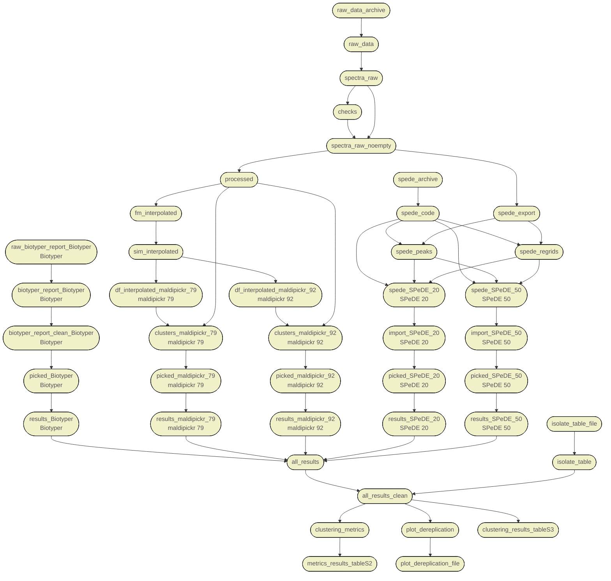

# workflow for maldipickr manuscript

This repository contains the code for the comparison of dereplication approaches as part of the manuscript describing the [R package maldipickr](https://clavellab.github.io/maldipickr/) ([CRAN](https://doi.org/10.32614/CRAN.package.maldipickr)) using data at [](https://doi.org/10.5281/zenodo.15744631).


## Setup the environment for the workflow

These analyses were conducted in R 4.3.1 and Python 3.9.13 orchestrated from Rstudio. We recommend setting up R and specific versions using [`rig`](https://github.com/r-lib/rig#id-features), and getting Rstudio from [Posit](https://posit.co/download/rstudio-desktop/). We also use [`renv`](https://rstudio.github.io/renv) for reproducible environment, which can be installed in R with `install.packages("renv")` and [`uv`](https://docs.astral.sh/uv/) as a very fast Python package manager (as one of the tool in the benchmark uses Python).

0. Make sure you have installed [`uv`](https://docs.astral.sh/uv/)
1. Open Rstudio and create a new project via "File > New Project..."
2. Select "Version Control" and then "Git"
	1. Type `https://github.com/ClavelLab/maldipickr_manuscript` in Repository URL.
	2. Make sure the project is going to be created in the correct subdirectory on your computer, or else edit accordingly
	3. Click on "Create project"

If you comfortable with the command line and git, clone the repository either with SSH or HTTPS in a suitable location.

3. Rstudio warns you that `One or more packages recorded in the lockfile are not installed` because a couple of R packages and dependencies are needed.
	1. Install the dependencies by typing `renv::restore()` in the Console and agree to the installation of the packages.
	2. Check that all dependencies are set by typing `renv::status()` in the Console where you should have `No issues found`


## Run the workflow

Our analysis workflow is orchestrated by [`targets`](https://docs.ropensci.org/targets/) and can be run with the following command in the R console:

```r
targets::tar_make()
```


## Overview of the workflow

This is the dependency graph of the different objects (i.e., targets) generated in R during the workflow.


